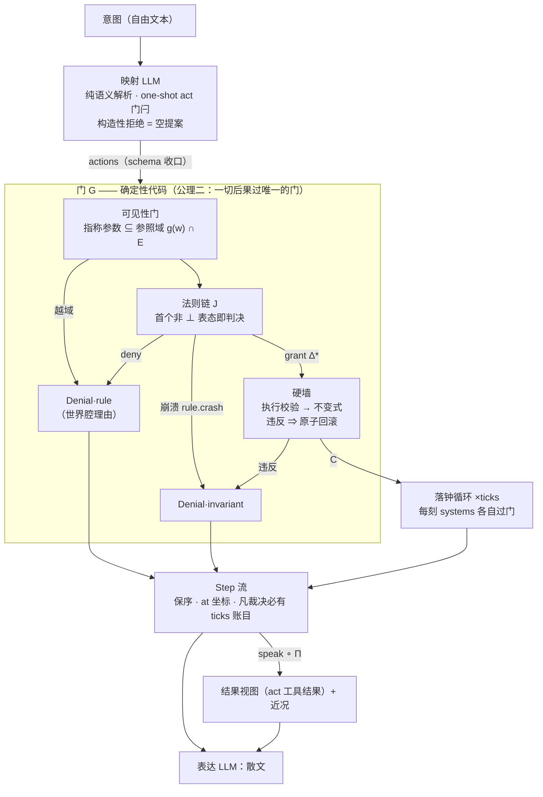

# 语言游戏引擎设计方案

## 定位与核心主张

**以确定性状态机为重量锚点、以 LLM 为映射与表达的交互式文字游戏引擎。**
- **文本即操作面**：用自由文本表达操作意图，不限制输入方式（选中场景散文片段 / 输入框 / 快捷键 / 菜单），不限制交互UI。
- **AI 不产生系统后果。** 玩家操作的「重量」由确定性状态机提供，AI 只负责让操作的反馈有文学生命力。
- **忠实是赌注。** 映射是否忠实于意图、散文是否忠实于状态，不做判定，否则即引入第二个被信任的语义引擎（循环信任）。
- **只有「无法表达」（而非「表达痛苦」）有资格驱动 core 的机制增长。** games/ 代码允许任意写法与重复样板，这是创作者的自由，即便多个游戏收敛出相同形态，也不得提升为 core 机制。

## 形状：记号、循环与公理

**公理**是定义性承诺；**协议不变量**是公理的直接推论；**回合协议**是本引擎在不变量之上选定的缺省协议实例。**指不出推导来源或选择理由的引擎形态即设计警报**。

### 世界代数

| 记号 | 契约 | 代码锚 |
|---|---|---|
| `w = (E, R, t)` | World：实体、类型化关系边、单调钟 `t ∈ ℕ` | `World` |
| `e = (id, name, props)` | Entity：id 稳定非空、name 非空；props 键 ⊆ 注册表（词汇闭合） | `Entity`、integrity 墙 |
| `r = (from, to, type, v)` | Rel：存储边永不持 null——「无边」由边表缺席表达 | `Rel` |
| `V = S ∪ S*` | 账本值 = 标量或标量数组；null 是缺席的记号，只活在值语言 | `LedgerValue` / `PropValue` |
| `Δ` | 五原语 set/relSet/rename/spawn/despawn：绝对写，`w → w` 的偏函数，定义域 = 可执行性 | `Delta`、`commit` |
| `G(Δ*, src) = C ⊎ Den` | 门 = 执行校验 + 不变式；原子性：拒 ⇒ w 不变；src ∈ rule:* / system:* / def | `commitChecked` |
| `C` | 变更记录 = 后态的完整 diff（prev/next 自含） | `Change` |
| `Q` | 裁决读态 (w 深冻结, player, t, params, roll)；越权写即抛 | `Q` |
| `roll(t, src, key, sides)` | 确定性骰子 → [1..sides]；命运地址 = (t, src, key) 元组编码 | `roll` |
| `J: Q → Grant ⊎ Deny ⊎ ⊥` | 法则表态；Grant = (Δ*, reason?, F?, ticks?)；⊥ = 弃权 | `Verdict`、`Rule.judge` |
| `adjudicate(a)` | 可见性门 → 首个非 ⊥ 的 J；全弃权由引擎闭合（`action.unanswered`） | `adjudicateRaw` |
| `apply(a)` | G∘adjudicate 后按授予逐刻落钟（systems）；钟的唯一写者 | `Simulation.apply` |
| `Step = ActionStep / TickStep` | 事件流：按构造保序、at 坐标、凡裁决必有 ticks 账目 | `Step` |
| `g: W × 锚 → 𝒫(E)` | grounding；参照域 = `g(w, 锚) ∩ E` =「意志能点名什么」 | `GameDef.grounding`、`visibleIn` |
| `π_e, π_p: W × 锚 → 谓词` | 边感知与属性感知（缺省恒真）：同一谓词约束状态视图与事件投影的对应面；谓词读物化真相，感知不物化为内容 | `edgePerception`、`propPerception` |
| `span(s) = (g, π_e, π_p)(w⁻, w⁺)` | 判定跨度：提交边界两侧感知截面（实体集、边键、属性键），随步冻结、提交后不可重算 | `FieldSpan` |
| `speak(c)` | 变更行可说 ⟺ `ref(c) ⊆ span(s)`（rel/prop 行另须边/属性截面：存在性按两侧并集，值侧披露分侧门控、未采样侧以「?」占位）；与名字解析分立 | `spineLines` |
| `Π(条目窗口, w_now)` | 近况：纯函数投影、永不持久化；可说性随步冻结，活输入唯名字 | `projectWindow` |

### 回合循环

### 公理

**公理一（世界即账本）**：`w = (E, R, t)`。

- **形状封闭**：世界顶层键 = {time, entities, relations}、实体顶层键 = {id, name, props}——状态侧不得有账本外的隐藏状态，动态侧不得有裁决中的隐藏变量（integrity 墙逐条钉住）。
- **后果必可说**：变更说为 C、氛围与理由说为 F、时间流逝说为步记录里经裁决归因的刻数；中间态经 `internal` 标记合法不可说。
- **名字是引擎自有词汇**：id 与 name 是每个实体的必备卡（非空字符串，integrity 钉住），随 spawn/despawn 的 C 进出状态——离场名只存在于变更记录，经 rename delta 可变。指称与键控的锚是 id 与裁决时读态：协议指称恒为 id，规则键控恒读当前态，名字只承担呈现。

**公理二（一切后果过唯一的门）**：∀ 变异恰一入口 `G(Δ*, src)`。

- **墙审世界**：任何 bug 无法绕过（fail-closed）。
- **后果只能由确定性代码产出。**

### 协议不变量

- **提交全序**：G 的回滚与出处以「前态 w⁻」为锚。
- **内容与坐标二分**：E、R 是**内容**——门的原子域；t 是**坐标**——排序轴、单向非负整数，不产 C、不在回滚域，排他性只在写入侧（谓词照常读钟）。墙审内容，坐标不设墙；坐标否决不可回滚——时间条件属于规则/系统谓词，坐标否决只会永久冻结。钟的唯一写者是落钟循环，形状由 integrity 钟契约钉住。
- **随机是世界的纯函数**：同 `(t, src, key)` 恒同值——apply 与存档恢复一致；命运地址继承出处命名空间，跨法则/系统重名不共享命运。
- **感知是注入的投影**：感知与呈现钩子（g / edgePerception / propPerception / digestExtra / summarize）住 def 不住账本，core 只留机器消费的空槽；缺省全见是零破坏缺省（选择——钩子缺席时取最少销毁信息的形状）。推论：**裁决侧不读投影**——规则分支于世界真相（可达性等机制谓词是投影的原料，不是感知槽；违反现实规则的世界由 authored 形态承载）。（公理一只排除感知谓词作为隐藏状态；空槽集、缺省全见与钩子签名统一收意志锚是选择——单意志下锚即 def.playerId 常量，参数是多意志变体的泛化关节）
- **言语是惰性对象**：意图经映射层分类为类型化参数，规则对参数裁决，原文作为惰性数据随裁决存入 props/relations；言语的机械后果只能由 speech-act 动词物化。
- **动力学三分**：确定性代码只有三个可运行时机——动作裁决时（J，管此刻的离散因果）、tick 内（systems，管此后的连续因果）、提交审计时（invariants，管永远）；同一扇门、同一产出原语（Δ / F / Den）。
- **门的全面性与历史原子性**：G 是全函数——三分代码的崩溃在门内代谢为必要性否决：法则崩溃 → `rule.crash`（fail-closed，时价照耗；无世界腔理由，noResponse 兜底）；系统崩溃 → `system.crash`（失败刻步，余系统照跑，时刻照走）。投影钩子（g / edgePerception / propPerception）与内核代码的异常不在输出域内代谢——投影不产世界事件，def 缺陷在 apply 边界**原子回滚后原样重抛**：正常返回 ⇔ 步骤流与账本互证且授予刻数走完，逃逸 ⇔ 世界恢复调用前原状——凡不可说者不发生。

### 回合协议

- **一回合一意志**：act 是言语行为通道，每回合恰好一个说话人。意志即提案者，提案唯一形态是经映射译码（act 工具）。意志不在世界里——账本里没有玩家，`def.playerId` 是指向普通实体的**居所引用**（integrity 墙管辖、指针不可重绑）。多意志不触任何公理与不变量，是未实例化的协议变体，若实例化：每意志一个居所引用、提交者入步记录——单意志下该义务恒退化为省略。
- **one-shot 门闩 + 通道次序**：act 一次性提交先行（选择·回合是地籍单位：一格回合一意图一提案，提案不得见自身结果，裁决先于叙述进入通道）；门闩封本回合第二次调用。提案内世界逐动作裁决、刻随动作流逝（后一动作在后一世界态上裁决）。
- **裁决驱动落钟**：「无裁决即无流逝」是触发源的选择——映射是 LLM 在环，秒级延迟使实时成为另一种体验形态而非同型变体；提案对其自身结果不可见；近况与审计以回合为自然单位（选择——窗口与条目的粒度锚）。动词声明尝试时价（cost，成败皆耗——选择·均匀性：门是法则站点，凡入裁决的尝试皆为世界事件，拒绝不豁免，否则免费拒绝沦为试错探针；「凡裁决必有时间账目」的推论不依赖它），规则可在授予中改写实际刻数（ticks）；时长可经类型化参数由语言提案、由规则裁决。派生语义：**凡裁决必有时间账目**——门被调用即裁决事件发生，刻数随步记录（可为 0）；**授予与执行分离**——verdict 的 ticks 是授予的权威记录、随 verdict 生死，执行与授予的一致由同一落钟循环按构造成立。apply = 裁决 → 提交 → 按授予刻数逐刻落钟；授予刻数在裁决入口校验形状（非负整数，违约走不变式通道）。刻是世界的因，不是意志的果（每刻 systems 照常运行），不是回合的别名；事件流是按构造保序的 Step 序列，at 坐标使其可核验可复原。

### 词汇面

- **世界语言**：玩家可见的一切文字（法则理由、不变式 message、回退摘要）与表达契约（voice）；表达散文由模型在契约下生成，对已锚定内容的转写与渲染一律自由。
- **通道语言**：引擎↔模型的 prompt 脚手架、act 工具描述与校验反馈、结果视图的协议锚（未解析行、新见 id 卡）——协议基础设施，不进玩家视野；映射契约（one-shot 门闩、空提案、预计被拒也提交、叙述跟随结果）的文案单源，系统块/工具描述/回合提示/门闩四方消费同一措辞。
- **开口键按字面**：谓词的声音面只设在声明卡上——卡随词汇闭合而存在（prop/verb 的 label）；开口 token 层（关系类型、tag token）无卡，机械行按字面言说（键即词），其世界腔由表达层承担。

### 地籍

- **持久化事实 = 地籍条目 = 回合定稿**（intent + steps 原样，写点唯一 = 回合定稿，intent 是玩家原话、逐字入账）。绕过引擎的裸 `apply` 不产生条目——情节记忆（近况）是回合制域，后果的可说性由状态视图独立承载（公理一在状态侧满足）；凡刻必在某次映射授予内，近况的入账完备性由定义成立。
- **近况**：Π(条目窗口, w_now)——纯函数投影、不持久化、随时可重建。
- Π 的可说性已随步冻结（判定跨度随条目，提交后不可重算），活输入唯名字：在世者随世界现值（改名连续性），离场者随变更记录（离场名只存在于记录）。**入账完备性按构造成立**——写点唯一，steps 由回合协议整体捕获，无第二类调用者需要义务；**名字闭合是定理不是前提**，且免费成立：Π（compact，变更行由状态视图承载）解析的指称只有尝试行参数（理由与 Fact 是写入时内联的字面文本，不过解析），act 结果与回退摘要逐调用自含（spineLines 缺省底表＝本步集 despawn 记录），均不依赖地籍纪律；指称的合法来源封闭于活体状态视图（新见实体卡同源；近况对合法指称渲染名字、不渲染 id），故被指称者裁决时必在世，其失效至多发生在引用之后，失效条目由窗口后缀序保证仍在窗口内（机械变更行这一半由门钉死：死实体不受任何 delta）。唯一倒转处是被拒尝试对幻觉 id 的原样回显——属门「幻觉与隐藏同一文案」的领域，非闭合破口。
- **玩家原话**：intent 逐字入账（近况记录 + 会话审计），投影侧以结构惰性形态渲染（JSON 串编码——玩家文本不得在机械投影中制造行边界或伪造条目）；作为后果时经 speech-act 动词物化为账本惰性记录。
- **机械事件史**（内核：裁决行、刻步、拒绝标记）：字段取舍是工程量决策；进裁决输入的形态只有账本本身。
- 新鲜义务只系于映射消费点；条目写点（回合定稿）与映射消费点之间输入恒不动，区间内求值观察等价。

## 模拟层：面向作者的契约

### 规范面

动词表（`GameDef.verbs`）的字段契约：

| 字段 | 契约 |
|---|---|
| `schema` | 生成 act 工具参数校验，并推导规则参数的编译期类型。参数须为标量——【推论】一次尝试 = 一个裁决 = 一个时价 = 一个拒绝单位，多重性由批次承载（提案可并列多动作），probe 的枚举域因此有限；对象与标量数组虽可单行线性化，账本值的数组是状态侧形状、不入尝试语言。 |
| `cost` | 尝试时价（刻，缺省 0）；规则的 `ticks` 可改写实际流逝 |
| `ref`／`free` | 字符串参数的 kind 标记（schema 上的声明）：ref＝指称参数——可见性门管辖全部指称参数（门权威 = grounding ∩ 账本——感知声明不得为不存在的实体铸造指称，谎报的 id 静默离场：不进视图、不可指名），机械渲染解析为名字，probe 按其枚举；free＝自由字符串（许愿/内容），值按字面进入裁决，径由法则裁决。参照域即「意志能点名什么」——**视野内引用**（实体卡）、**已知引用**（出口、旅行史、对话获名：visited/known 标记由规则经 delta 写入，internal 令标记对模型不可见，grounding 并入参照域）。门不退位：拒绝只回答「不可指名」，幻觉 id 与隐藏实体同一文案 |
| `internal` | 内部动词，只存在于裁决面。裁决面 ⊋ 广告面（门的调用者是确定性代码，映射层只是其一），补集必须在声明面可表达；由代码直接 apply——同一裁决边界与硬墙；属性注册表的 internal 是同一结构在词汇面的实例，广告面与裁决面是一张表的两个消费面 |
| `rules` | 卫语句链：按序裁决，首个表态即判决；Q 只读由结构保证（深冻结，越权写即抛） |

**主体性两概念**：

- **意志（玩家）**：act 通道的说话人；意志不在世界里，账本里没有玩家——`def.playerId` 是指向普通实体的居所引用。
- **视角**：感知函数的现值——游戏经 grounding 注入，状态视图的实体索引与之构造等价；可感知而不可指名的纹理走 digestExtra 的无 id 通道。
- **投影钩子统一收意志锚**（grounding / edgePerception / propPerception / digestExtra / summarize 均收 def.playerId）：钩收锚不收体验者——锚比推导值信息更全，魂的自见排除、按魂键控的知识都需锚本身，体验者相对的投影由此可表达而锚信息不丢；钩子可无视锚（上帝视角即无视锚的常函数）。
- **无主语动词的缺省主语是体验者**——体验者由包含拓扑推导（居所建模为魂时 = 链上最近器皿），视角与门随链跟随。第一人称（感知以居所为缺省）、上帝视角（感知全开 + 主语显式入参，神力动词照常过门）、附身（占据 = 居所的 `in` 迁移，一条 delta 过门；角色会死会换的游戏把居所建模为魂/叙述者等不朽实体，占据建模为 id 属性而非关系边——器皿之死才会被拦成显式迁移）都是主体性概念的取值模式。
- 人称与受话人是呈现投影的取值：只保证每回合把「谁在看」以可投影形态交给呈现层；账本 name 是协议锚而非时变真相，规则理由串内联人称，动态人称由规则从世界态计算或以无主语句式交表达层补足。

**法则纪律**：

- **规则即代码**：J 收只读 Q（world/player/time/params + roll），返回授予（Δ 列表 + 世界腔理由 + facts + ticks）、结构化拒绝（Den）或 ⊥（不表态，交由后续规则）。
- **承重墙**：键控形态下规则必须以属性组合为键，禁止特判实体 id。泛化的另一半是数据载荷：量级与效果参数存于属性，一条规则覆盖一切——键控管「何时对谁」，载荷管「多少」；规则随新实体自动泛化，这是组合爆炸的唯一出路。
- **分辨率即链**：每动词一条卫语句链——顺序即优先级、弃权是唯一组合算子；优先级是作者知识。键控的泛化拓扑只在 probe 的裁决地图（按法则分组的法则×动词活性矩阵）上被看见。
- **两种创作形态**共用同一裁决与提交硬墙：**键控形态**（规则按属性组合键控、随新实体自动泛化）；**authored 形态**（互动逐实体书写：每条一个卫语句子句 + 兜底；实体生灭、动态拓扑、持有物改写互动结果）。
- **拒绝**：结构化 Denial（law/reason/debug），理由以世界腔内联在规则文本里，缺省回落 `messages.noResponse`。拒绝不携带涉及实体：指称的落点是 action 参数（结构化）与法则理由（世界腔），第三方指称可由 law 在裁决时世界态上重算。`deniedBy: "rule"`（卫语句链、可见性门、全部未表态的引擎闭合 `action.unanswered`）是玩法——世界性理由；`"invariant"`（硬墙否决、授予形状违约、法则代码失灵 `*.crash`）是必要性拦截——probe 报 bug。可见性门归 rule（感知是世界真相，拒绝为世界性；耗时价承回合协议的均匀性选择，非本分类的推论）。覆盖面没有机械判据：probe 穷举可见域产出裁决地图供人判读兜底落点，缺口判断属创作者。
- **前置门两站点**：静态形态（动词存在、schema）错在裁决之外——工具边界由 pi 校验拒绝（错误回模型、可重试、门闩未耗），内核收到同类动作即调用方违约，抛 `ProtocolViolation`；世界真相在裁决之内——可见性门（感知是世界真相，拒绝为世界性、耗尝试时价；门的世界腔只依赖公开状态：幻觉 id 与隐藏实体同一文案，未入域的指称在尝试行原样回显、不解析名字）→ 规则。施动前提等语义前提一律写成第一条卫语句规则，谓词由 games 层构件/模块助手供给。**接线判据**：前提的否定情形落在参照域内（可指名而不可及）才接线法则，落在域外（不可指名——暗箱内容物）由门独任，重复接线即死法则；grounding 以物理谓词（可达性）定义感知域是触觉认识论的合法取值，其代价是物理前提层被门吸收——grounding 与前提法则是同一次认识论决策的两面，改其一必重审另一；法则的存活条件是世界×认识论的合取，不是接线习惯。probe 的法则×动词活性矩阵（弃权/未达计数、零表态显影）是唯一显影处。

### 动力学面

- `systems` 是按序执行的纯函数注册表（每 tick 运行，产出 deltas/facts），承载连续因果；fact-only 纯氛围输出合法，零状态变更的氛围事实同样进入表达输入。**刻步无应答**：应答（reason）是动作协议的义务，凡裁决必有对尝试的回应；系统不回应任何尝试，产出只以变更与事实说话；失败刻只来自必要性通道（`system.crash` 或硬墙否决），其可说由拒绝派生。
- **时长是裁决授予的后果维度**：apply 是完整的裁决边界（裁决 → 提交 → 按授予刻数逐刻落钟运行 systems），产出并入表达输入——世界能在一次提交的多个行为之间反应。静默刻（零产出）在结果视图与近况中仍须表达时间流逝：动作步的 ticks 是授予的权威记录。
- 随机经 `Q.roll(key, sides)`（命运地址，同地址重读得同一命运）；多时间尺度（刻/日/月）由 systems 谓词从刻数取模派生（复杂历法可自持计数器）。

### 必然性

提交受两翼审查，任一违反即**原子回滚整个提交并拒绝**：

- **执行翼**（裁决被如实执行）：每条 delta 在其应用时刻必须可执行——逐条校验而非提交前预检（同一授予内 spawn 后 set 是合法书写）：目标实体与关系端点必须存在、关系类型须为非空字符串（边的身份组成）、spawn 的 id 必须未占用、rename 的名字须为非空字符串、一切数值后果必须有限（NaN/Infinity 不合法）；一切账本值必须可单行线性化（结构化状态的居所是实体与平键，不是匿名记录）。幂等跳过的唯一判据是「目标状态已成立」：relSet 删不存在的边成立（无边即状态）、set 清已缺席的键成立（缺席即状态）；set 同值以目标存在为前提——存在性拒绝在前，不回落为跳过。裁决理由与变更流必须互证——静默丢弃 delta 即叙述对账本说谎。
- **状态翼**（执行后的世界成立）：默认恒挂 integrity——id 唯一、卡片契约（id 与名字非空）、钟契约（time 非负整数）、id 型属性指向存在的实体（「无引用」由缺席表达，清除写 null 即删键）、账本形状封闭（世界/实体/关系边顶层键闭合、存储值非 null、标量或标量数组——边值与属性值同一契约；any 只豁免标量类型检查、不豁免账本值形状）、边身份契约（类型为非空字符串 token、三元组唯一——身份是感知快照与可说性的键，影子边使读写静默分叉）、注册表类型契约与词汇闭合（实体属性键 ⊆ 注册表：type 层封闭、token 层开放，与动词表同构；自由值形状走 any 与 tags，动态键值对走关系边）；游戏追加领域不变式；守恒类种子读 `InvariantCtx.genesis`（实际起点世界的冻结快照，存档恢复与变体开局同样成立）。

- **不变式可见提交**：`InvariantCtx` 携带 `genesis`、`changes`（本次提交的全部变更，含 spawn/despawn）与 `src`。**状态不变式**只读世界——守恒类，防总量漂移；**过渡不变式**读提交——provenance 类，防错误再分配；每条规则/系统的提交独立过墙，过渡不变式的粒度即单次提交。出处是提交级事实（一次提交恒一产出方），住在提交边界——ctx.src 与步记录 src；变更记录是纯内容。类型契约管词汇，过渡不变式管语义（这一次提交是否必要）。
- **`invariant` 是独立的否决来源**：法则否决是玩法（世界性理由），墙否决是必要性拦截，审计与探测应能区分。
- **意志的居所在墙的管辖内**：初始世界同样过墙（构造期校验，genesis = 自身、changes = 空）——「不变式管永远」包括 t=0。由此显式声明两个立场：**指针不可重绑**——居所引用在 def 层恒定；附身/换躯不改指针（占据是居所的 `in` 迁移）。**居所不朽，器皿可生灭**——墙保护的是意志的居所：终局是状态不是删除；占据建模为 id 属性时，器皿之死被 id 引用契约拦下——意志的迁出必先作为 delta 入账（迁移可说，静默回退不可说）；占据期间居所迁移的合法性由过渡不变式钉住；推导兜底（hostOf 缺省居所自身）只覆盖「未入链」态，不豁免迁移的可说性。

### 生灭与拓扑

- Δ 五原语：set 值 null 即删键、relSet 值 null 即删边；null 是缺席的记号，不入存储，缺席的唯一形态是键不在场，记忆由变更记录承担（prev/next: null）。提交产出按基底类别同构分形的变更记录 C：rel 携带完整边端点（next null 即删边；despawn 级联删边同一形状）、rename 携带 prev/next 名字、spawn 携带完整后态实体（事件流自足于重放）、despawn 携带展示名——离场名只存在于记录。
- despawn 级联清理关系边——级联是 despawn 的机械后果（弱引用随主消散，消散可说），逐条入账且按边表序紧随 despawn 记录，变更流因此是后态的完整 diff；悬空 id 引用由完整性硬墙回滚（强引用挡 despawn）。
- 关系边表 `world.relations` 表达社会 / 叙事状态，表达层格式化为世界腔文本。

### 感知面

- **状态视图**：可见实体（grounding）× internal 滤（机械词汇不进 prompt）∧ 属性感知谓词 × 关系端点可见过滤 × 边感知谓词；游戏派生纹理 `digestExtra` 入独立 `extra` 键（形态自由 ViewValue）——无引用声明面：纹理以名字分组陈述可指名者（实体卡已在视图），以字面模糊披露不可指名者（行动须先物化为已知引用）。视图实体索引 ≡ 可见性门权威集——模型看得见的才可指名，可指名的必看得见；卡上属性包同理——可感的值必在卡上，卡上的必可感。act 结果的**新见段**是同一装配线的回合内增量：本回合新进参照域的实体以状态视图同形的实体卡（含 id）承载——纹理与指称锚在裁决当回合闭合。
- **边感知**：`edgePerception`（与 grounding 同形的空槽：世界 × 体验者 → 投影函数）声明体验者知觉哪些边，缺省恒真；同一谓词约束状态视图的 relations 块与事件投影的 rel 变更行，边感知快照随步携带。二元知觉（知其有／不知其有）；rel 行的值侧披露与 prop 行同规。
- **属性感知**：`propPerception`（同形空槽：世界 × 体验者 → 槽谓词，收实体×键）声明体验者知觉哪些属性值，缺省恒真；同一谓词约束状态视图的 props 块与事件投影的 prop 变更行，属性感知快照随步携带（键集 spanKey 元组编码，枚举注册表键——缺席即状态、缺席槽的可感性同问；存在性按两侧并集判据，值侧披露分侧门控、未采样侧不披露；值随 Change.prev/next 自含，截面只存键）。谓词读物化真相——「知其有不知其值」的知识居所仍是账本（知晓边等），感知不物化为内容；谓词按构造不铸造指称（只对在册实体×已声明键求值），可感 id 值在变更行中仍受 referents 门控。槽知觉与宿主知觉正交：prop 行的指称集只含值（居所迁移行系于值指称，不系于魂的自见性），宿主可见性不是截面的维度。`internal` 与感知正交：机械词汇旗标，对一切呈现面永不渲染，其无体验者维度是本性（协议噪声本非感知），不再是隐藏通道。
- **事件投影**：act 结果视图与回退摘要是世界对体验者的应答，与状态视图消费同一个 grounding。变更行按「全部指称在场」投影：主语、关系端点、声明为引用的取值——渲染与投影消费同一解析函数；未声明为引用的字符串一律字面，与实体 id 的碰撞不铸造指称。尝试行与变更行的机械指称解析同受参照域管辖、按声明驱动：指称参数（ref 标记）与 id 型属性值解析为名字（域内取当前名，窗口内离场者取离场名），域外引用原样回显，其余字符串一律字面。判定跨度是步的感知截面 {w⁻, w⁺}（实体集、边键、属性键；感知分辨率继承提交边界的离散化；任一端在场——单端谓词在「进入/离开感知域」的原型知觉上自相矛盾），由 Simulation 产出步时计算（动作步前态复用可见性门，刻步按系统提交逐个取），随步携带——与 Change.prev/next 同一本体：提交后不可重算、只存在于记录（冻结是证据性选择：变更自含、骰子纯函数使重放重算技术上可行，但重算即用提交后的知识改写历史——旧行突然可说是泄漏通道；记录须是证据而非视图）。**可说性与名字解析分立**：行可说性只认冻结跨度（渲染窗口不扩权），离场底表是纯名字面——窗口内一切 despawn 记录供名（离场名曾随实体卡公开，不因离场方式失密），隐藏离场者自身的行恒沉默（跨度不含离场者），跨度可说的历史行离场后仍以离场名渲染。沉默行的净效果由状态投影承接（新见/离场），模糊知觉的唯一通道是作者 Fact。理由与 Fact 不过投影：规则铸造的世界语，作者特权（summarize 声音覆写）是唯一合法越权口——与「拒绝不携带涉及实体只约束门」是同一条纪律在时间维的落点。模型认识论由此闭合：Π(S_now) ⊕ 被感知事件 ⊕ 作者 Fact。
- **投影按消费者分类**：进协议通道（约束裁决可行集）的投影，与真相的一致性必须机械保证；只服务工具与呈现的投影（裁决地图、意图菜单）永不进协议通道，形态自由。豁免：Verdict 的 reason/facts 同进协议通道，但属规则铸造的世界语（作者特权），机械只保证送达不保证保真。

## 映射层

- **纯语义解析**：无关键词/正则匹配、无别名表、无语言限制——动词与实体由 LLM 从 `name + attrs + 上下文` 纯语义接地。
- **one-shot 门闩**：模型先调 `act` 一次性提交动作提案（或以空提案拒绝），门闩封的是本回合的第二次调用，`act` 工具结果是世界回应的唯一载体。
- **AI不写拒绝理由**：构造不出合法提案时提交空 actions；能构造的动作一律直接提交——「预计被拒」不是拒绝的理由而是提交的理由，「是否合理」的判断属于世界，不属于映射。

## 表达层

- AI 读状态视图 + 本回合变更 + 法则 facts，输出该状态的文字化。
- **表达契约（`voice`）**：静态世界语言文档，原样注入 system prompt，缺省无契约；协议块是引擎机械的说明书，不随游戏漂移。
- **内部属性隔离**：`internal: true` 的属性不进序列化 / 变更线性化。
- **回合骨架（spineLines）**：事件流的规范单行渲染——符号承担结构（✓/✗/⏱/×n）、语言词全部来自 messages/label/规则文案，internal 变更恒滤。结果视图（模型）、近况（compact 投影）、控制台与缺省回退摘要共用同一线级机械；回退摘要缺省 = 骨架投影；`summarize` 是可选的声音覆写——读原样 steps（与理由/Fact 同属作者特权），崩溃回落缺省，呈现缺陷不得丢弃已发生的账目。
- **叙述不回流**：回合输入 = 当前状态 + 变更（act 工具结果）+ 近况窗口。
- **场景呈现服务**：表达层的场景模式可独立调用——无提案通道、无 act 通道、无时间流逝，不是回合。正当调用时刻的判据：账本中存在可说而未被说过的状态内容。

## 表达力推导：通道代数

「无法表达」的判定不靠直觉：裁决面图灵完备（规则/系统/不变式是开放词汇上的任意代码），不可表达只可能栖居于**定签通道**——游戏意义必须穿过的、类型被 core 钉死的边界。通道从类型签名清点完毕，每通道以三轴向刻画：载体（能持什么）、粒度（能对什么区分）、方向（状态/感知/事件/记录/入）。

| 通道 | 载体 | 粒度 | 方向 |
|---|---|---|---|
| props／`internal` | LedgerValue | 实体×键×全局 | 状态＋感知＋事件三面 |
| relations（开口 token，无注册表） | LedgerValue | 边×全局 | 状态 |
| `grounding` | id 集 | 体验者×实体 | 感知 |
| `edgePerception` | bool | 体验者×整条边 | 感知 |
| `propPerception` | bool | 体验者×实体×键 | 感知 |
| `digestExtra` | ViewValue | 体验者×自由（无 steps 参数、无指称面） | 感知·仅状态面 |
| `narratableChanges` | 变更行 | internal 滤 | 事件 |
| `viewCard` | 实体卡 | internal ∧ propPerception | 感知 |
| `FieldSpan` | 实体／边键集 | 体验者×步·随步冻结 | 事件 |
| `Verdict` | deltas/reason/facts/ticks | 步 | 事件 |
| `Action` schema | 平标量 | 尝试 | 入 |
| `Chronicle` | intent＋steps | 回合×常量窗口 | 记录 |

**方法＝覆盖矩阵**：机制维度（灵感来源表即维度清单）×通道粒度求覆盖，空格即候选；每个候选再过四条证伪路线——**换通道**（边→属性、拒绝→零 delta 授予、提问→拒绝理由）、**物化**（历史/预期/信念→属性）、**拆动词**（成本不对称、条件 schema→动词分裂）、**键设计**（命运共享、效果叠加→地址/数据归约）。四路皆不通者才是「无法表达」候选，且仍须由真实探针实例化方可立项（准入原则不变）。

**存活格**：
  - **批次内真同时性**：applyBatch 是 fold，单意志下休眠，多意志变体实例化时激活。

**可证伪预测**：单意志游戏中，状态/动力学/感知面完全闭合；未来 core 增长只可能来自批次同时性格。侵蚀度量由此获得具名格子与可检验预测，而非「希望预测为零」。

## 研究层：探针章程

games 层是研究仪器不是产品。表达力检验是一条流水线：**推导（通道代数覆盖矩阵）→ 实例化（探针）→ 判定**。**判定单位是格子，不是探针**——归因隔离发生在判定层（每格一套场景锁，场景各自以初始世界起跑），不在器物层；因此单个「陈列馆式」最小探针即可承载全部研究需求，前提有三：

- **展品准入**：探针里每个动词/系统/机制必须具名它实例化的格子（覆盖矩阵坐标），无格子的展品不得入馆——极小性按关切计，不按器物计；
- **场景先于世界**：新研究需求先试「在既有世界上写场景锁」，唯格子无法在既有世界实例化时才扩展世界（侵蚀度量在探针层的镜像：扩展即记录）；
- **体量外迁**：需要事件体量的压测（投影噪声、近况可读性）属于场景/夹具层——场景可以 spawn 出体量，游戏保持极小。

单探针相对探针序列的决定性收益是**复合格**：通道×通道的二阶交互（改名×known 的跨室指称连续性、知晓×附身的知识随魂、掷火下边的消散与属性的强引用对照）只有在通道共存的单一世界里才可实例化——逐格分探针在结构上够不到它们。

覆盖不了的残余：**多意志同时性**是协议变体（引擎层），任何 GameDef 都不覆盖；**批次多动作压力**与 **e2e 会话规模**属于 loop 阅读与夹具，不属于游戏层。

统一探针＝`seals`，展品清单（展品→格子）：

| 展品 | 格子 |
|---|---|
| 信文 propPerception（知晓边为判据；机械行随知晓可说） | 属性感知槽 |
| 全边隐藏＋亲和/疑心桶级披露 | 知其有不知其值（换通道路线） |
| 誊写自由字符串 | 许愿径＋言语惰性物化 |
| 攀谈（heard 物化＋introduced internal 标记）＋grounding 并入 | known 生命周期（对话获名） |
| 揭面（rename）×known 跨室指称 | 复合格：改名连续性 |
| 收发清单（id 数组）＋掷火的系连检查 | id 数组／强引用挡 despawn（世界腔面） |
| 魂 playerId＋附身迁移＋掷火器皿／魂不可自指（门） | 主体性机：居所迁移过门、器皿可生灭、居所不朽 |
| 掷火：边随主消散 vs 属性须先解 | 弱/强引用二分的机制面 |
| 交割/流言/漂移 systems（NPC↔NPC 边） | 离屏因果、NPC 边动力学 |
| 走动（邻接前提法则、时价成败皆耗、视角随居所翻转） | 前置门两站点的语义前提站点；尝试时价；grounding 注入投影 |
| 夜笺送达（system spawn→书案，清单生长，交割续接） | 离屏生灭入账：法则铸造的存在、id 数组生长、新见卡 |
| 占问（同刻同签） | 随机是世界纯函数：命运地址 |
| grounding 锚定 hostOf、魂被删除 | 无主语动词缺省主语＝居所链最近器皿 |

## 非目标（显式不做）

- 词表式语言约束：语言是 LLM 的原生能力
- 一次提交的动作数无上界：忠实是赌注
- 散文断言检查器：忠实是赌注
- 刻数授予无上界：不违反任何契约
- 数据法则（AST解释器）：无明显收益
- 模型自撰的回合纪要通道：自述偏差经上下文跨回合放大
- 直达提案通道：意志的提案必经映射译码，引擎不设第二条提案入口与仪器摇钟——时间控制属于场景夹具（裸 apply）与玩家动词
- 多 actor 离屏自治（NPC 由 LLM 驱动）
